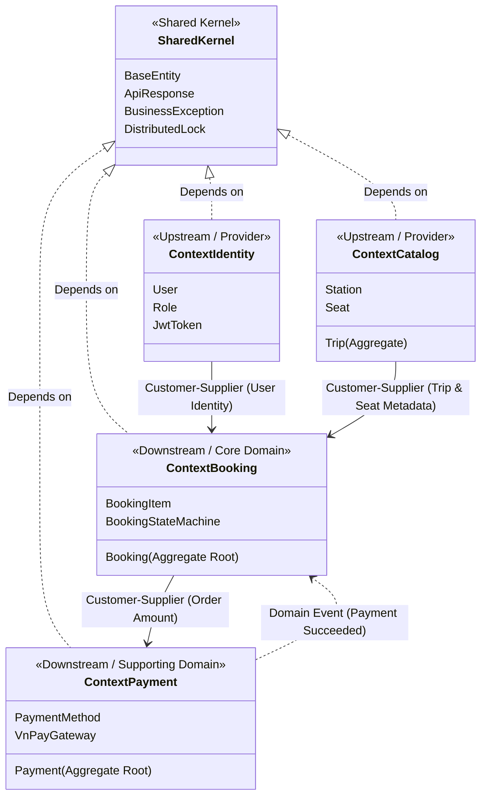

# 02.2. Bản Đồ Ngữ Cảnh Chiến Lược (Context Mapping)

```mermaid
classDiagram
    class SharedKernel {
        <<Shared Kernel>>
        BaseEntity
        ApiResponse
        BusinessException
        DistributedLock
    }

    class ContextIdentity {
        <<Upstream / Provider>>
        User
        Role
        JwtToken
    }

    class ContextCatalog {
        <<Upstream / Provider>>
        Trip (Aggregate)
        Station
        Seat
    }

    class ContextBooking {
        <<Downstream / Core Domain>>
        Booking (Aggregate Root)
        BookingItem
        BookingStateMachine
    }

    class ContextPayment {
        <<Downstream / Supporting Domain>>
        Payment (Aggregate Root)
        PaymentMethod
        VnPayGateway
    }

    SharedKernel <|.. ContextIdentity : Depends on
    SharedKernel <|.. ContextCatalog : Depends on
    SharedKernel <|.. ContextBooking : Depends on
    SharedKernel <|.. ContextPayment : Depends on

    ContextIdentity --> ContextBooking : Customer-Supplier (User Identity)
    ContextCatalog --> ContextBooking : Customer-Supplier (Trip & Seat Metadata)
    ContextBooking --> ContextPayment : Customer-Supplier (Order Amount)
    ContextPayment ..> ContextBooking : Domain Event (Payment Succeeded)
```
